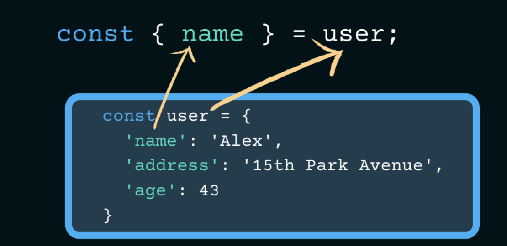

# Whats is Object in JavaScript ?
- в javascript объект представляет собой отдельную сущность со свойствами и типом
# Methods object :
# Object.entries()
- const obj = { name: "alijon" , age: 22,}
- console.log(object.entries(obj));
- // Output : [ ['name' , 'alijon'] , ['age' , 22] ]
# Object. keys()
- const obj = { name: "Tohira" , age: 20,}
- console.log(object.keys(obj));
- // Output : ['name' , 'age']
# Object. values()
- const obj = { name: "Tohira" , age: 20,}
- console.log(object.keys(obj));
- // Output : ['Tohira' , 20]
# what is Destructuring and Spread in JavaScript ?
- синтаксис присваивания деструктуризации — это выражение Javascript, которое позволяет распаковывать свойства объекта в отдельные переменные.

const test = {
  prop: 42,
  func: function () {
    return this.prop;
  },
};

console.log(test.func());
// Expected output: 42

const test = {
  prop: 42,
  func: function () {
    return this.prop;
  },
};

console.log(test.func());
// Expected output: 42
# what is keyword “ this ” in JavaScript ?
- в методе объекта this относится к объекту.
- само по себе это относится к глобальному объекту.
- в функции это относится к глобальному объекту.
- в функции в строгом режиме это не определено
- это не переменная. это ключевое слово. вы не можете изменить значение этого
